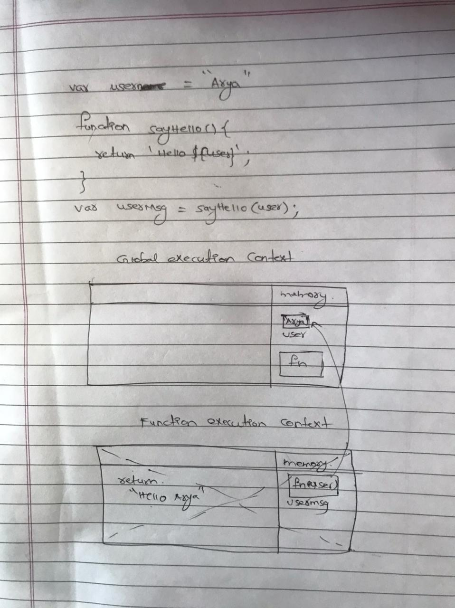
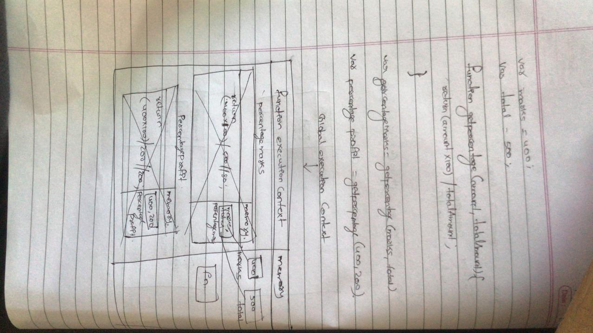
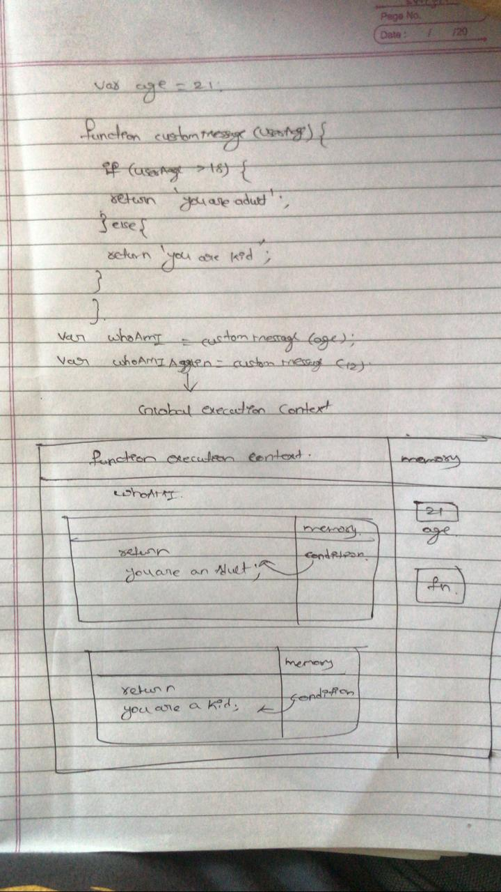

1. What does thread of execution means in JavaScript?
```js
A thread of execution means that how the JavaScript engine works when we enter any piece of code. 
```

2. Where the JavaScript code gets executed?
```js
The JavaScript code gets executed in the global exexution context by the reference of the memory.
```

3. What does context means in Global Execution Context?
```js
Context means that the code which we are executing in the Global Execution Context from the JavaScript engine.  
```

4. When do you create a global execution context.
```js
Whenever we are writin a piece of code JavaScript engine will create the single Global Execution Context.
```

5. Execution context consists of what all things?
```js
 Execution context consists of the code which is not going to be executed. 
```

6. What are the different types of execution context?
```js
1. Global Execution Context.
2. Function Execution context.
```

7. When global and function execution context gets created?
```js
- Whenever the piece of code is running the global execution context will be created
- Whenever the piece of code is executing the function execution context will be created.
```

8. Function execution gets created during function execution or while declaring a function.
```js
During function execution
```


9. Create a execution context diagram of the following code on your notebook. Take a screenshot/photo and store it in the folder named `img`. Use `` to display it here.


```js
var user = "Arya";

function sayHello(){
  return `Hello ${user}`;
}

var userMsg = sayHello(user);
```

<!-- Put your image here -->




```js
var marks = 400;
var total = 500;

function getPercentage(amount, totalAmount){
  return (amount * 100) / totalAmount;
}

var percentageMarks = getPercentage(marks, total);
var percentageProfit = getPercentage(400, 200);
```

<!-- Put your image here -->




```js
var age = 21;

function customeMessage(userAge){
  if(userAge > 18){
    return `You are an adult`;
  }else {
    return `You are a kid`;
  }
}

var whoAmI = customeMessage(age);
var whoAmIAgain = customeMessage(12);
```

<!-- Put your image here -->


